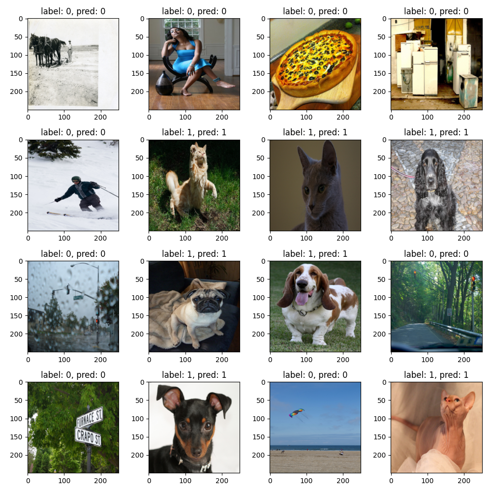

# cat-collector
For 2023 aoop group project classification part
## Description
Classify cats and dogs by their breeds with total 37 catagories. Use efficientnet as backbone and train with pytorch.

Download datasets from : [kaggle](https://www.kaggle.com/datasets/zippyz/cats-and-dogs-breeds-classification-oxford-dataset/data?select=images)

```bash
kaggle datasets download -d zippyz/cats-and-dogs-breeds-classification-oxford-dataset
```
```bash
unzip cats-and-dogs-breeds-classification-oxford-dataset.zip
```
## move images to individual folders
```bash
bash ImageFolder.sh
```

## check if there is corrupted images
```bash
python check_file.py
```

## train
```bash
python train.py
```

## demo
```bash
python demo.py
```