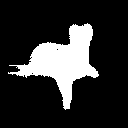
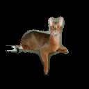

# cat-collector
For 2023 aoop group project  
Image segementation using segmentation_models_pytorch
## Unzip the dataset
``` bash
unzip cats-and-dogs-breeds-classification-oxford-dataset.zip
```
## convert the mask images into readable format
```bash
python convert.py
```
## remove corrupted files
```bash
python check_file.py
```
## convert the images and masks into npy format
```bash
python png2npy.py --pathFrom ./images --pathTo ./images_npy
python trimap2npy.py --pathFrom ./annotations/trimaps --pathTo ./masks_npy
```
## verify if the npy files are correct
```bash
python verify.py
```
After preprocessing, you will have folders 

## run the training script
```bash
python train.py
```

## run the inference
```bash
python inference.py
```

## result
| Original | MASK | Image with mask |
| ---- | ----- | --- |
|| |   |