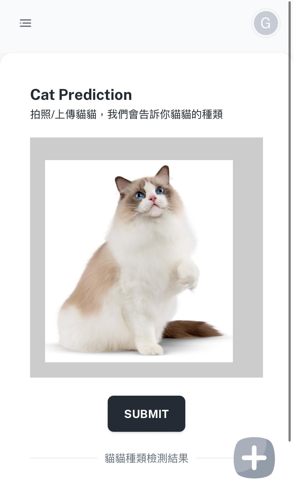
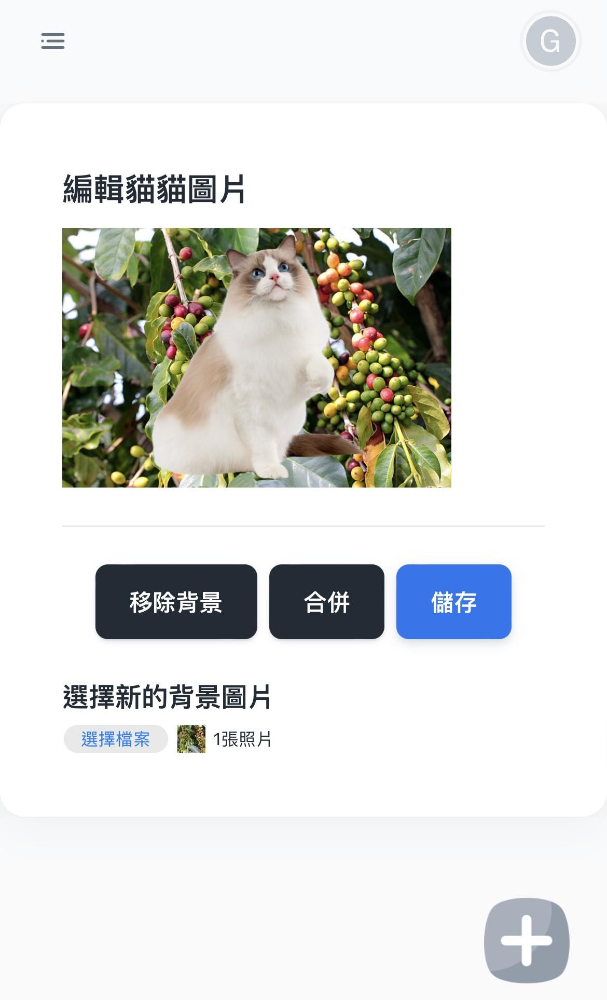
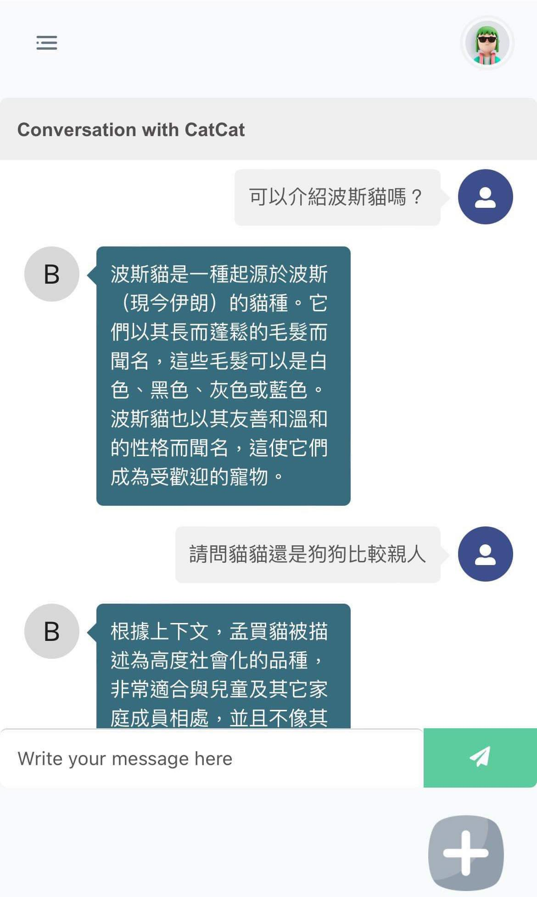
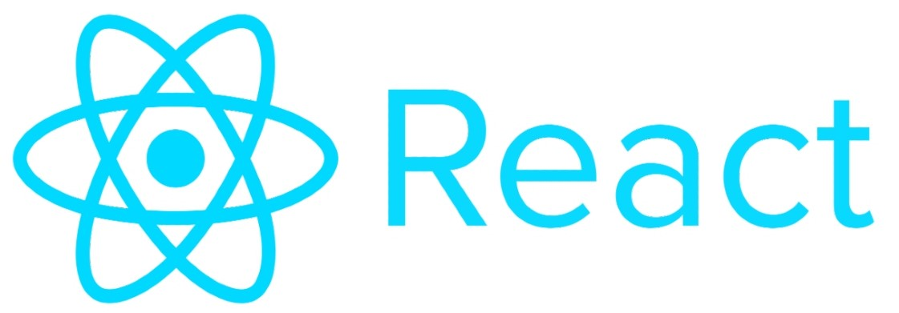

# cat-collector
For 2023 aoop group project

## Cat and Dog Collector Website:
The aim to this website is to encourage people to spend more time outdoors, collecting pictures of cute cats and dogs they encounter in their daily lives.

| Classifier breeds | Remove background | Chat bot |
| ------- | ------- | --------- |
|  |  |  |

We've designed a user-friendly interface featuring an 'upload images' button for easy cat and dog breed classification. Users can also seamlessly edit the background of these images. Additionally, a download button is available to save the newly edited images.

Additionally, we've implemented a chatbot interface to enhance user experience, allowing intuitive input for questions.

## Function:
### For the AI Model:
When users capture photos of cats or dogs with their phone's camera, they can upload these photos to the website. The website's backend incorporates AI models for identifying cat and dog breeds and removing backgrounds. It can save the silhouettes of cats and dogs as PNG files, allowing users to keep them.

When faced with issues related to cats and dogs, users can submit their questions to the chatbot, which is built on Taiwan Llama with RAG, and receive prompt and accurate answers.

### For the website:

In addition to the features mentioned above, the website can provide personalized recommendations for cats and dogs based on your input.

The website allows users to change the background of cats and dogs in their collected images. This feature enhances the joy of collecting digital cards and enables users to share their creations with friends.

## Programming Framework:
- website Design: React
- AI Model: PyTorch

The website development will be done using React, an open-source framework known for its efficiency and flexibility. This choice ensures a robust and dynamic platform, enabling seamless user interactions and enhanced functionality

The AI model development will be handled using PyTorch, a powerful deep learning framework, for tasks such as breed recognition and background removal.

This exciting website project combines website development with AI capabilities to enhance the experience of collecting and sharing pictures of adorable cats and dogs.

## Keyword on the Working Items

### website
- UI Design
- Image Upload
- Save Images
- Change Backgrouds

### AI Model
- Cat and Dog Breed Recognition
- Background Removal (Clipping)
- Chat Bot
- Model Deployment

## CICD flow
1. Complete certain feature in branches
2. Make PR to main branch and wait for review & merge
3. Trigger GitHub Action and deploy to GCP VM

## Deployment
1. Flask server, frontend, backend and sql are served by NGINX
2. Having DNS name and OpenSSL certificate
3. Flask server -> python engine run at port 5000 -> proxy pass to nginx /cat/
4. Nodejs server -> docker run forwarding to port 3000
5. Frontend -> build out and server by nginx (root location /)
