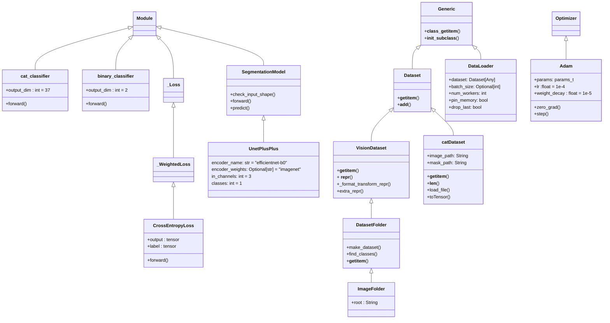

```mermaid
classDiagram
    class Module{
    }
    class binary_classifier{
        +output_dim : int = 2
        +forward()
    }
    class cat_classifier{
        +output_dim : int = 37
        +forward()
    }
    class Generic{
        +__class_getitem__()
        +__init_subclass__()
    }
    class DataLoader{
        +dataset: Dataset[Any]
        +batch_size: Optional[int]
        +num_workers: int
        +pin_memory: bool
        +drop_last: bool
    }
    class DatasetFolder{
        +make_dataset()
        +find_classes()
        +__getitem__()
    }
    class ImageFolder{
        +root : String
    }
    class VisionDataset{
        +__getitem__()
        + __repr__()
        +_format_transform_repr()
        +extra_repr()
    }
    class Dataset{
        +__getitem__()
        +__add__()
    }
    class Optimizer{
    }
    class Adam{
        +params: params_t
        +lr :float = 1e-4
        +weight_decay : float = 1e-5
        +zero_grad()
        +step()
        
    }
    class CrossEntropyLoss{
        +output : tensor
        +label : tensor
        +forward()
    }
    class UnetPlusPlus{
        encoder_name: str = "efficientnet-b0"
        encoder_weights: Optional[str] = "imagenet"
        in_channels: int = 3
        classes: int = 1
    }
    class SegmentationModel{
        +check_input_shape()
        +forward()
        +predict()
    }
    class _Loss{
    }
    class _WeightedLoss{
    }
    class catDataset{
        +image_path: String
        +mask_path: String
        +__getitem__()
        +__len__()
        +load_file()
        +toTensor()

    }
    Module <|-- cat_classifier
    Module <|-- binary_classifier
    Module <|-- _Loss
    _Loss <|-- _WeightedLoss
    _WeightedLoss <|-- CrossEntropyLoss
    Module <|-- SegmentationModel
    SegmentationModel <|-- UnetPlusPlus
    DatasetFolder <|-- ImageFolder
    VisionDataset <|-- DatasetFolder
    Dataset <|-- VisionDataset
    Generic <|-- Dataset
    Dataset <|-- catDataset
    Generic <|-- DataLoader
    Optimizer <|-- Adam
```
