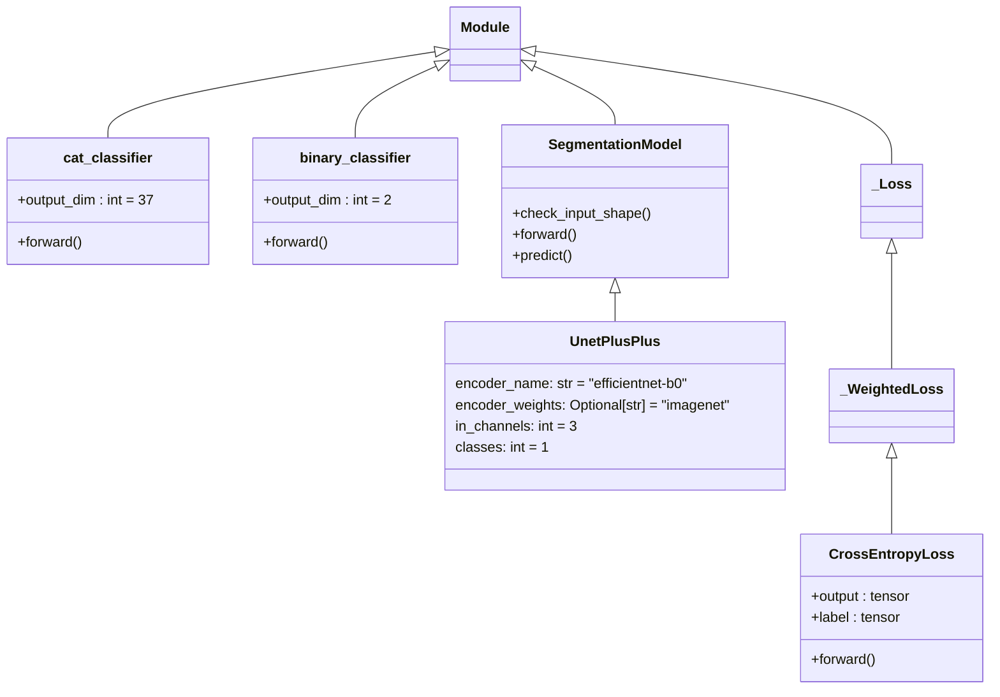

```mermaid
classDiagram
    class cat_classifier{
        +output_dim : int = 37
        +forward()
    }
    class Module{
    }
    class binary_classifier{
        +output_dim : int = 2
        +forward()
    }
    class CrossEntropyLoss{
        +output : tensor
        +label : tensor
        +forward()
    }
    class UnetPlusPlus{
        encoder_name: str = "efficientnet-b0"
        encoder_weights: Optional[str] = "imagenet"
        in_channels: int = 3
        classes: int = 1
    }
    class SegmentationModel{
        +check_input_shape()
        +forward()
        +predict()
    }
    class _Loss{
    }
    class _WeightedLoss{
    }
    Module <|-- cat_classifier
    Module <|-- binary_classifier
    Module <|-- _Loss
    _Loss <|-- _WeightedLoss
    _WeightedLoss <|-- CrossEntropyLoss
    Module <|-- SegmentationModel
    SegmentationModel <|-- UnetPlusPlus
```