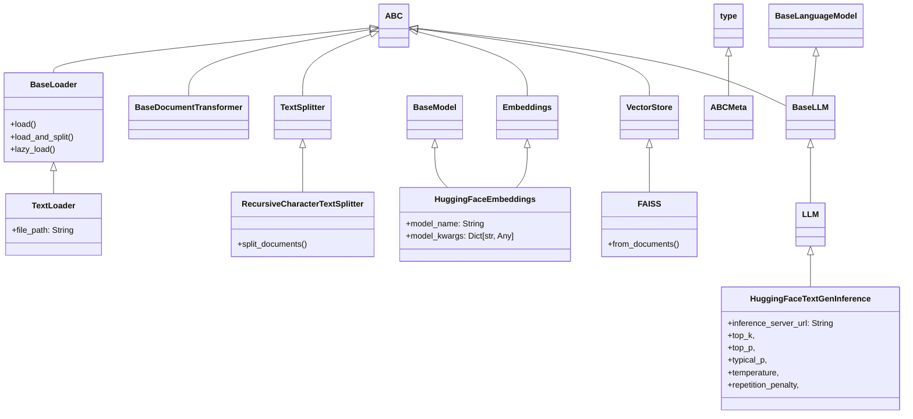

```mermaid
classDiagram
class TextLoader{
    +file_path: String
}
class BaseLoader{
    +load()
    +load_and_split()
    +lazy_load()
}
class ABC{  
}

BaseLoader <|-- TextLoader
ABC <|-- BaseLoader

class RecursiveCharacterTextSplitter{
    +split_documents()
}

class TextSplitter
class BaseDocumentTransformer
ABC <|-- BaseDocumentTransformer
ABC <|-- TextSplitter
TextSplitter <|-- RecursiveCharacterTextSplitter

class HuggingFaceEmbeddings{
    +model_name: String
    +model_kwargs: Dict[str, Any]
}
class BaseModel
class Embeddings
class ABCMeta
class type
type <|-- ABCMeta
BaseModel <|-- HuggingFaceEmbeddings
Embeddings <|-- HuggingFaceEmbeddings
ABC <|-- Embeddings

class FAISS{
    +from_documents()
}
class VectorStore
ABC <|-- VectorStore
VectorStore <|-- FAISS

class HuggingFaceTextGenInference{
    +inference_server_url: String
    +top_k,
    +top_p,
    +typical_p,
    +temperature,
    +repetition_penalty,
}
class LLM
class BaseLLM
class BaseLanguageModel
LLM <|-- HuggingFaceTextGenInference
BaseLLM <|-- LLM
BaseLanguageModel <|-- BaseLLM
ABC <|-- BaseLLM


```